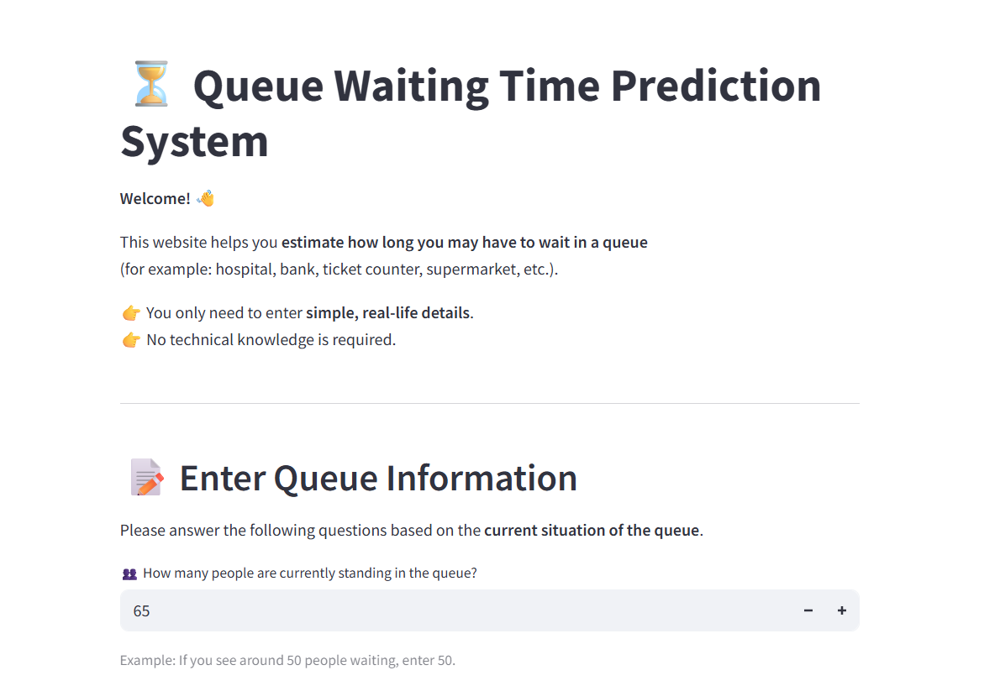
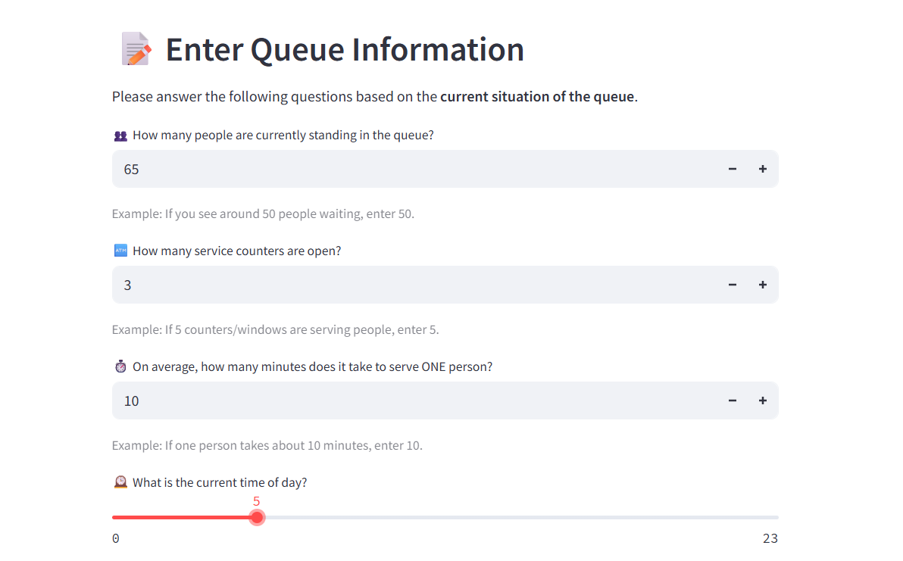
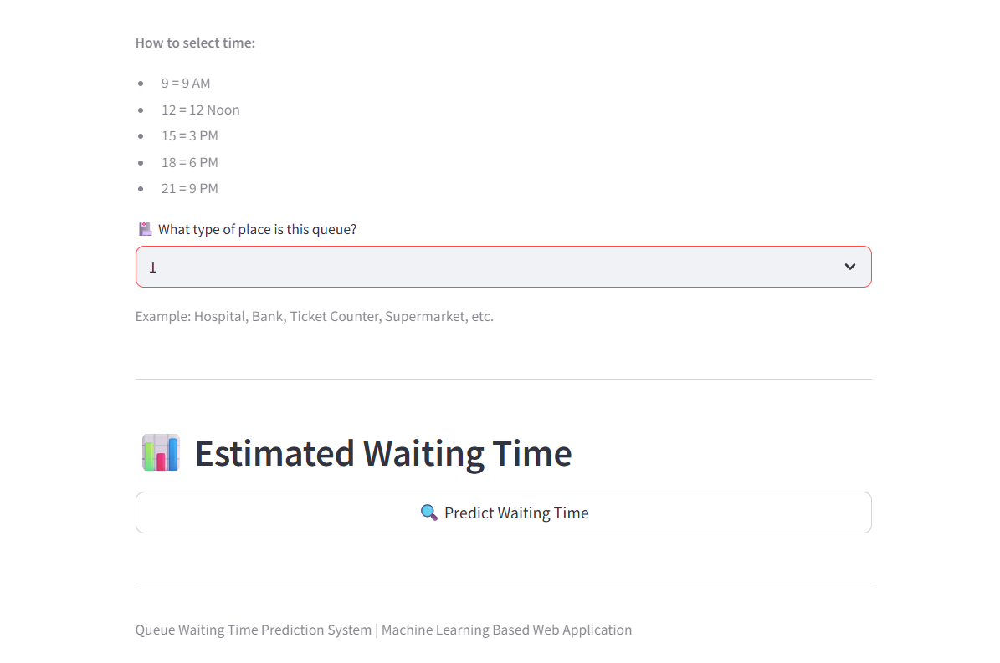
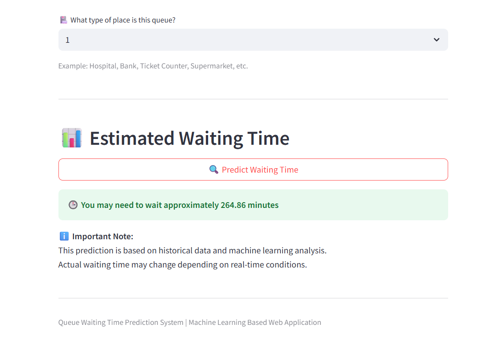

# ⏳ Queue Waiting Time Prediction System

## 📌 Project Overview
The **Queue Waiting Time Prediction System** is a machine learning–based application designed to predict the estimated waiting time of customers standing in a queue.  
The system analyzes multiple real-world factors such as queue length, number of open counters, average service time, time of day, and queue type to provide accurate waiting time predictions.

This project is built using **Python, Machine Learning (Scikit-learn), and Streamlit**, making it suitable for academic projects, real-time simulation, and deployment as a web application.

---

## 🎯 Problem Statement
In places such as banks, hospitals, supermarkets, railway stations, and service centers, long queues lead to customer dissatisfaction and poor resource management.  
Manual estimation of waiting time is often inaccurate.

This project aims to:
- Predict queue waiting time accurately
- Improve customer experience
- Assist management in optimizing service counters

---

## 💡 Solution Approach
The system uses a **Random Forest Regressor** trained on historical queue data.  
Key preprocessing steps include:
- Encoding categorical queue types
- Scaling numerical features
- Training and evaluating the regression model
- Deploying the trained model using Streamlit

---

## 🧠 Machine Learning Model
- **Algorithm Used:** Random Forest Regressor
- **Problem Type:** Regression
- **Evaluation Metrics:**
  - Mean Absolute Error (MAE)
  - R² Score

The trained model, scaler, and encoder are saved as `.pkl` files for reuse in the Streamlit application.

---

## 📊 Dataset Description
The dataset contains the following features:

| Feature Name | Description |
|-------------|------------|
| Number_of_People | Total people in the queue |
| Counters_Open | Number of service counters available |
| Avg_Service_Time | Average service time per person (minutes) |
| Time_of_Day | Hour of the day (0–23) |
| Queue_Type | Type of queue (e.g., Bank, Hospital, Ticket Counter) |
| Waiting_Time | Target variable – waiting time (minutes) |

---

## 🛠️ Tech Stack
- **Programming Language:** Python
- **Libraries:** Pandas, NumPy, Scikit-learn
- **Web Framework:** Streamlit
- **Model Persistence:** Pickle
- **IDE:** Jupyter Notebook / VS Code

---

## 📁 Project Structure

Queue_Waiting_Time_App/
│
├── data/
│   └── queue_waiting_time_large_dataset.csv
│
├── model/
│   ├── waiting_time_model.pkl
│   ├── scaler.pkl
│   └── queue_encoder.pkl
│
├── images/
│   ├── input0.png
│   ├── input1.png
│   ├── input2.png
│   └── output.png
│
├── train_model.py
├── app.py
├── requirements.txt
└── README.md

---

## 📸 Application Screenshots

### Input Page


### User Inputs


### Prediction Action


### Output Result


---


## ▶️ How to Run the Project


```bash
# 1️⃣ Clone the Repository
git clone <your-github-repo-link>
cd Queue_Waiting_Time_App

# 2️⃣ Install Required Libraries
pip install -r requirements.txt

# 3️⃣ Train the Model
python train_model.py

# 4️⃣ Run Streamlit App
streamlit run app.py


